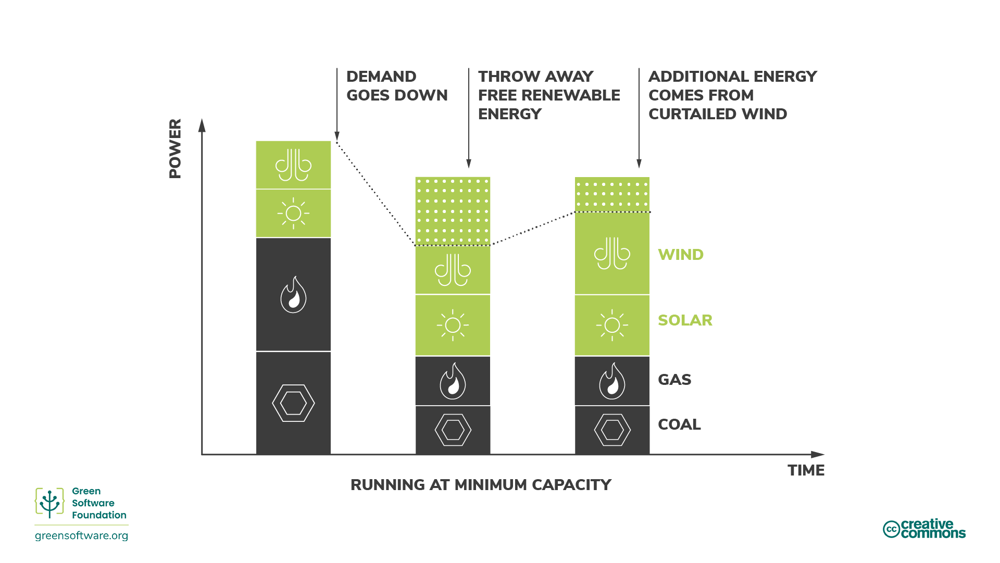
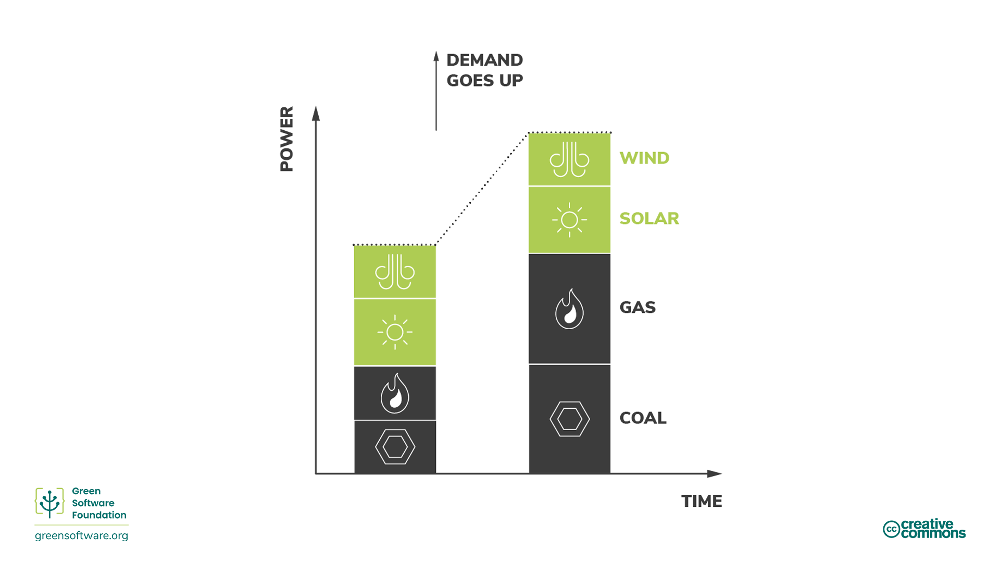
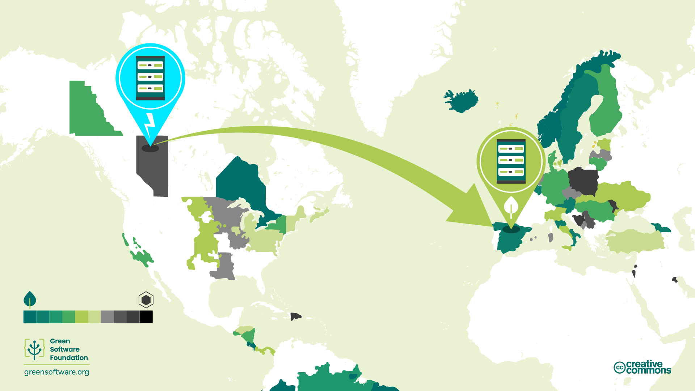
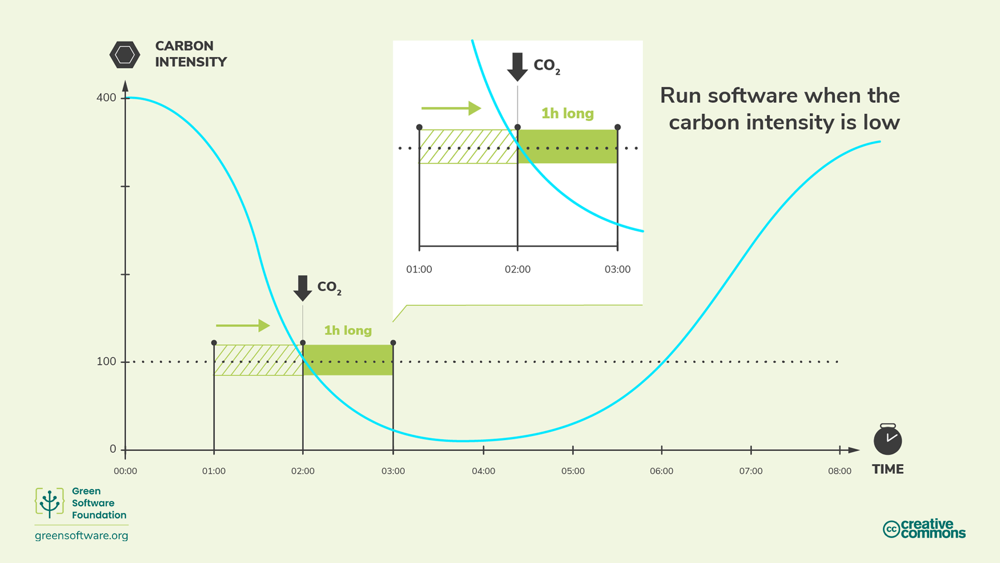
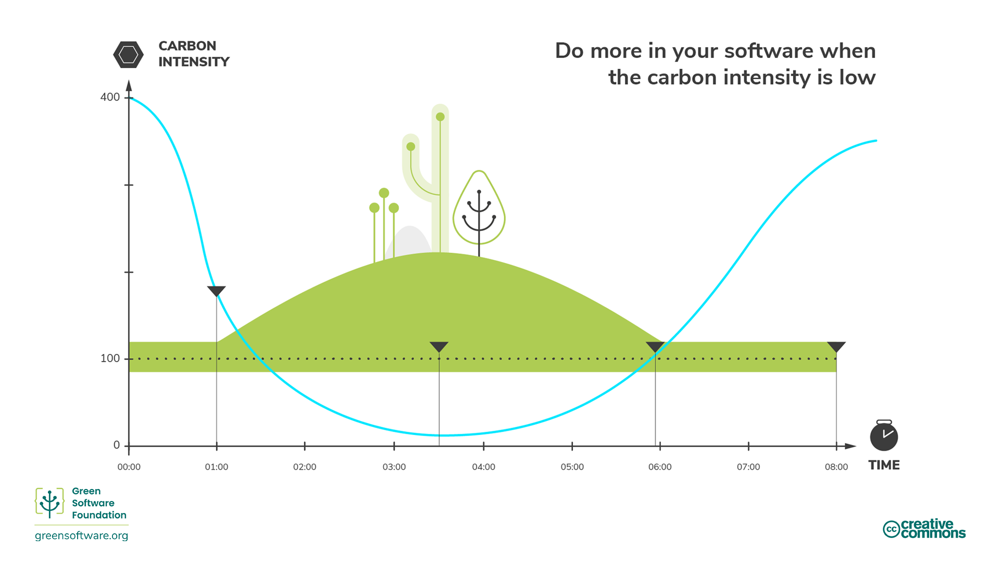

::::::::::::::::::::::::::::::::::::::: objectives

- Understand the concept of *carbon intensity* in electricity generation
- Appreciate the level of variation in carbon intensity across the UK and the world
- Understand techniques for greener use of HPC: demand shifting and demand shaping

::::::::::::::::::::::::::::::::::::::::::::::::::

:::::::::::::::::::::::::::::::::::::::: questions

- How does electricity generation affect GHG emissions?
- What is *carbon instensity* of electricity generation and how does it vary geographically and temporally?
- What techniques can I use to make my use of HPC greener and influence transition to low-carbon electricity generation?

::::::::::::::::::::::::::::::::::::::::::::::::::

## Introduction

Not all electricity is produced in the same way. In different locations and times, electricity is generated using a variety of sources with varying carbon emissions. Some sources, such as wind, solar, or hydroelectric, are clean, renewable sources that emit little carbon. On the other hand, fossil fuel sources emit carbon at varying degrees to produce electricity. For example, both gas and coal emit more carbon than renewable sources, but gas-burning power plants emit less carbon than coal-burning power plants.

Carbon awareness is the idea of doing more when more energy comes from low carbon sources and doing less when more energy comes from high carbon sources.

## Key concepts

### Carbon intensity

Carbon intensity measures how much carbon (CO2e) is emitted per kilowatt-hour (kWh) of electricity consumed. The standard unit of carbon intensity is gCO2e/kWh, or grams of carbon per kilowatt hour.

If your computer is plugged directly into a wind farm, its electricity would have a carbon intensity of 0 gCO2e/kWh since a wind farm emits no carbon to produce that electricity. However, most people can't plug directly into wind farms; instead, they plug into power grids supplied with electricity from various sources.

:::::::::::::::::::::::::::::::::::::::: callout

## Embodied carbon of renewable sources

In reality, the carbon intensity of renewable sources still have some GHG emissions associated with them from the emissions used to build, operate and decommission them. As we will se in a later episode, these emissions are usually amortised across the lifetime of the facility (in this case, the lifetime of the generation facility). By convention, these embodied emissions are not usually included in carbon intensity values for generated energy as they are complex to calculate and the emissions saved by replacing non-renewable sources with renewable sources have vastly outweighed the embodied emissions of renewable sources. These emissions sources will become a more important component of energy generation as electricity grids continue to decarbonise.

::::::::::::::::::::::::::::::::::::::::::::::::::

Once on a grid, you can not control which sources supply the electricity you are using; you simply get a mix of everything. So, your carbon intensity will be a mix of all the current power sources in a grid, both the lower- and the higher-carbon sources.

### Variability of carbon intensity

Carbon intensity varies by location since some regions have an energy mix containing more clean energy sources than others. This table shows the average carbon intensity for UK regions over 2024 (ref: [electricityinfo.org regional carbon intensity history](https://electricityinfo.org/region-archive/)):

| Type | Regions | Carbon Intensity (gCO2e/kWh) |
|--|------|------:|
| Low | N. Scotland, S. Scotland, N.E. England | 26 |
| Medium | E. England, | 130 |
| High | S.W. England, S. Wales, | 280 |

Similarly, this table compares values across the world in 2023 (ref: [Our World In Data](https://ourworldindata.org/grapher/carbon-intensity-electricity?tab=table)):

| Country | Carbon Intensity (gCO2e/kWh) |
|--------|------:|
| France | 56 |
| UK | 238 |
| USA | 369 |
| Germany | 381 |
| Russia | 441 |
| Japan | 485 |
| Australia | 549 |

Carbon intensity also changes over time due to the inherent variability of renewable energy caused by the unpredictability of weather conditions. For example, when it's cloudy or the wind isn't blowing, carbon intensity increases since more of the electricity in your mix comes from sources that emit carbon.

:::::::::::::::::::::::::::::::::::::::  challenge

## Exercise: Carbon emissions from HPC systems

One estimate of the power draw of ARCHER2 is 2.6 MW. Mean carbon intensities from different UK regions in 2024 give low emissions regions as 26 gCO2e/kWh, medium emissions regions as 140 gCO2e/kWh and high emissions regions as 280 gCO2e/kWh. What would the carbon emissions be from 1 year of ARCHER2 operations in the three different emissions regimes?

:::::::::::::::  solution

## Solution

TBC

:::::::::::::::::::::::::

:::::::::::::::::::::::::::::::::::::::

### Dispatchability & curtailment

Electricity demand varies during the day and supply always needs to be able to meet that demand. A brownout (a dip in the voltage level of the power line) occurs if a utility does not produce enough electricity to meet demand. Conversely, if a utility produces more electricity than is required, then to stop infrastructure burning out, breakers trip and we have blackouts.

There needs to be a balance between the demand and supply of electricity at all times and the responsibility for this usually falls to the utility provider.

In the case of fossil fuels such as coal, it is easier to control the power produced for this supply; this is called **dispatchability**. However, in the case of renewable power sources such as wind farms, the power produced cannot easily be controlled (we cannot control how much the wind blows). If the power source produces more electricity than is needed, that electricity is thrown away; this is called **curtailment**.

### Marginal carbon intensity

If you suddenly need to access more power - for example, you need to turn on a light - that energy comes from the marginal power plant. The marginal power plant is dispatchable, which means marginal power plants are often powered by fossil fuels.

Marginal carbon intensity is the carbon intensity of the power plant that would have to be employed to meet any new demand.

Fossil-fueled power plants rarely scale down to 0. They have a minimum functioning threshold, and some do not scale; they are considered a consistent, always-on baseload. Because of this, we sometimes have the scenario where we curtail (throw away) renewable energy while still consuming energy from fossil fuel power plants.

In these situations, the marginal carbon intensity will be 0 gCO2e/kWh since we know that any new demand will match the renewable energy we are curtailing.

### Energy markets

The exact market model varies around the world but broadly follows the same model.

When the demand for electricity goes down, utilities need to **reduce** the supply to balance supply and demand. They can do this in one of two ways:

1. **Buy less energy from fossil fuel plants.**

Energy from fossil fuel plants is usually the most expensive so this is the preferred method. This directly translates to burning fewer fossil fuels.

2. **Buy less energy from renewable sources**.

Renewable sources are the cheapest, so they prefer not to do this. If a renewable source does not manage to sell all of its electricity, it has to throw the rest away.

Reducing the amount of electricity consumed by your use of HPC can help decrease the energy's carbon intensity as the first thing to be scaled back are fossil fuels.

When the demand for electricity goes up, utilities need to increase the supply to balance supply and demand. They can do this in one of two ways:

1. **Buy more energy from renewable sources that are currently being curtailed**

If you are curtailing, it means you have excess energy you could dispatch. Renewable energy is already the cheapest, so curtailed renewable energy will be the cheapest dispatchable energy source. Renewable plants will then sell the energy they would have had to curtail.

2. **Buy more energy from fossil fuel plants**.

Fossil fuels are inherently dispatchable; they can quickly increase energy production by burning more. However, coal costs money, so this is the least preferred solution.

Energy markets are some of the most complex markets in the world so the above explanation is a simplification. But what is important to understand is that our goal is to increase investment into lower carbon energy sources, like renewables, and decrease investment into higher carbon sources, like coal. The best way to ensure money flows in the right direction is to make sure you use electricity with the least carbon intensity.

## How to be more carbon aware

::: tip

Using electricity when the carbon intensity is low is the best way to ensure investment flows towards low-carbon emitting plants and away from high-carbon emitting plants.

:::

There is a global transformation happening right now. All around the world, electricity grids are changing from primarily burning fossil fuels to sourcing energy from lower carbon sources like wind and solar. This is one of our best hopes for meeting our global reduction targets. As green users of HPC, let's see some of the ways we can help accelerate that transition.

The primary driver for the transition is economic rather than any sustainability target. Renewables are winning because they are cheaper and getting even more affordable over time. So, to help accelerate the transition, we need to make renewable plants more profitable and fossil fuel plants less profitable. The best way to do that is to use more electricity when it's coming from lower-carbon sources like renewables and less electricity when it's coming from higher-carbon sources.

Carbon intensity is lower when more energy comes from lower-carbon sources and higher when it comes from higher-carbon sources.

### Demand shifting

Being carbon aware means responding to shifts in carbon intensity by increasing or decreasing your demand. If your work allows you to be flexible with when and where you run workloads, you can shift accordingly - consuming electricity when the carbon intensity is lower and pausing production when it is higher. For example, running a simulation or model at a different time or region with much lower carbon intensity.

[Studies](https://ieeexplore.ieee.org/document/6128960) show these actions can result in 45% to 99% carbon reductions depending on the number of renewables powering the grid.

Demand shifting can be further broken down into spatial and temporal shifting.

#### Spatial shifting

Spatial shifting means moving your computation to another physical location where the current carbon intensity is lower. It might be a region that naturally has lower carbon sources of energy. For example, using an HPC facility sited in a location that is currently windy and so has a high proportion of wind power.

This requires you to have the ability to run on different HPC resources in different locations - for example, you could chose between running on a local HPC resource or a national HPC resource located elsewhere.

<!-- TODO: Maybe add advantages and disadvantages -->

<!-- TODO: Also mention impact of cooling overheads, different seasons in different hemispheres, cooler locations -->

#### Temporal shifting

If you cannot shift your computation spatially to another region, another option you have is to shift to another time. Perhaps later in the day or night when it's sunnier or windier and, therefore, the carbon intensity is lower. This is called temporal demand shifting. We can predict future carbon intensity reasonably well through advances in weather forecasting.

An example of a service that can predict carbon intensity to enable temporal demand shifting is the [carbonintensity.org.uk website and API](https://carbonintensity.org.uk).

Some of the large technology companies have recognised the importance of carbon awareness and are using advanced modeling techniques to implement demand shifting.

- **Google Carbon Aware Data Centers** - Google launched a project to [make some of the cloud workloads carbon aware](https://blog.google/outreach-initiatives/sustainability/carbon-aware-computing-location/). They created models to predict tomorrow's carbon intensity and workload. They then shaped large-scale workloads so more would happen when and where the carbon intensity is lowest, but in such a way that they could still handle the expected load.
- **Microsoft Carbon Aware Windows** - [Microsoft announced a project to make Windows 11 more sustainable](https://www.techradar.com/news/windows-11-is-getting-an-eco-friendly-update-but-could-microsoft-do-more). Initially, this means running Windows updates when the carbon intensity is lower.

### Demand shaping

Demand shifting is the strategy of moving computation to regions or times when the carbon intensity is lowest. Demand shaping is a similar strategy. However, instead of moving demand to a different region or time, we shape our computation to match the existing supply.

- If carbon intensity is low, increase the demand; do more (or faster) calculations.
- If carbon intensity is high, decrease demand; do less (or slower) calculations.

Demand shaping for carbon-aware HPC use is all about the supply of carbon. When the carbon cost of running your simulation or model becomes high, shape the demand to match the supply of carbon. This can happen automatically, or the user can make a choice.

Eco mode is an example of demand shaping. Eco modes are found in everyday appliances like cars or washing machines. When activated, some amount of performance is sacrificed in order to consume fewer resources (gas or electricity). Because there is this trade-off with performance, eco modes are always presented to a user as a choice.

Software or HPC services can also have eco modes that can - either automatically or with user consent - make decisions to reduce carbon emissions.

One example of this is video conferencing software that adjusts streaming quality automatically. Rather than streaming at the highest quality possible at all times, it reduces the video quality to prioritise audio when the bandwidth is low.

Another example is TCP/IP. The transfer speed increases in response to how much data is broadcast over the wire.

A third example is progressive enhancement with the web. The web experience improves depending on the resources and bandwidth available on the end user's device.

Demand shaping is related to a broader concept in sustainability, which is to reduce consumption. We can achieve a lot by becoming more efficient with resources, but we also need to consume less at some point.

As green users of HPC, we would consider cancelling or reducing the power intensity of our workflow when the carbon intensity is high instead of demand shifting - reducing the energy demands of our work.

:::::::::::::::::::::::::::::::::::::::  challenge

## Exercise: Demand shaping in HPC

A typical HPC system has a wide variety of jobs to schedule and different HPC systems have different scheduling and charging policies for jobs that run on them. Write down some ideas on how you could potentially modify the scheduling and charging of jobs to enable demand shaping on an HPC system?

:::::::::::::::  solution

## Solution

- Scheduling based on power intensity
  - Manual: users place jobs into different queues based on predicted power intensity. Charging discounts for users who use this facility
  - Automatic: system detects/predicts power intensity of jobs and schedules accordingly
- Credit based system:
  - Earning and spending periods: during earning period, users earn priority tokens based on how emissions efficient they are (would start with tokens and subtract to stop more tokens for more use). Spend period, users with most tokens get priority on system
  - See Fugaku approach
- Power capping approaches:
  - System power cap fluctuates with grid carbon intensity
  - Need a tool to distribute power cap amongst jobs
  - See HPE PowerSched and similar tools

:::::::::::::::::::::::::

:::::::::::::::::::::::::::::::::::::::

:::::::::::::::::::::::::::::::::::::::: keypoints

- Carbon awareness means understanding that the energy you consume does not always have the same impact in terms of carbon intensity.
- Carbon intensity varies depending on the time and place it is consumed.
- The nature of fossil fuels and renewable energy sources means that consuming energy when carbon intensity is low increases the demand for renewable energy sources and increases the percentage of renewable energy in the supply.
- Demand shifting means moving your energy consumption to different locations or times of days where the carbon intensity is lower.
- Demand shaping means adapting your energy consumption around carbon intensity variability in order to consume more in periods of low intensity and less in periods of high intensity.

::::::::::::::::::::::::::::::::::::::::::::::::::

