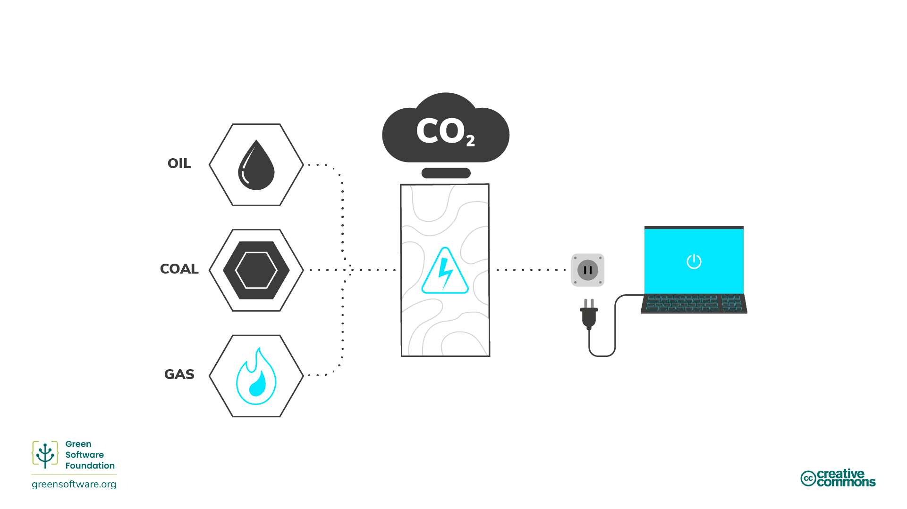
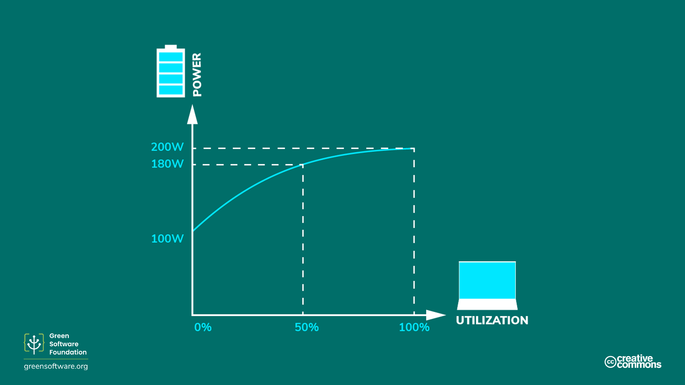

::::::::::::::::::::::::::::::::::::::: objectives

- TBC

::::::::::::::::::::::::::::::::::::::::::::::::::

:::::::::::::::::::::::::::::::::::::::: questions

- TBC

::::::::::::::::::::::::::::::::::::::::::::::::::

## Introduction

Energy is the ability to do work. There are many different forms of energy, such as heat, electrical and chemical, and one type of energy can be converted to another. For example, we convert chemical energy from coal to electrical energy. In other words, electricity is secondary energy converted from another energy type. In this way, we can think of energy as a measure of the electricity used.

All software, from the applications running on mobile phones to the training of Machine Learning models running in data centers, consumes electricity. One of the best ways to reduce electricity consumption and the subsequent carbon emissions made by software is to make applications more energy efficient. However, that’s not where our responsibility ends.

Green software practitioners take responsibility for the energy consumed by their products and design them to consume as little as possible. We should make sure that, at every step in the process, there is as little waste as possible and that most of the energy goes to the next step.

The final step in this chain is represented by the end user of your product, not the finished product itself. This means our goal is not simply to make the most energy efficient code or the “greenest” software, but to think about the end user and how to make sure they are not creating unnecessary emissions.

This might mean batching jobs together to take advantage of energy proportionality or changing how a user uses your software. Let’s take a look at some of these concepts and some ways that you can become more energy efficient at every stage of the chain, right up to the final consumer.

## Key concepts

### Fossil fuels and high-carbon sources of energy

Most electricity is produced through burning fossil fuels, [usually coal](https://ourworldindata.org/grapher/world-electricity-by-source). Fossil fuels are made from decomposing plants and animals. These fuels are found in the Earth's crust and contain carbon and hydrogen, which can be burned for energy. Coal, oil, and natural gas are examples of fossil fuels.

Most people think electricity is clean. Our hands don't get dirty when we plug something into a wall, and our laptops don't need exhaust pipes. However, since most electricity comes from burning fossil fuels and energy supply is the [single most significant](https://www.eea.europa.eu/data-and-maps/daviz/change-of-co2-eq-emissions-2#tab-chart_4) cause of carbon emissions, we can draw a direct line from electricity to carbon emissions. In these terms, electricity can be considered a proxy for carbon.

If our goal is to be carbon efficient, then it means our goal is also to be energy efficient since energy is a proxy for carbon. This means using the least amount of energy possible per unit of work.

### Low-carbon sources of energy

Clean energy comes from renewable, zero-emission sources that do not pollute the atmosphere when used and save energy through energy-efficient practices. There are overlaps between clean, green, and renewable energy. Here's how we can differentiate between them:

- **Clean energy** - doesn’t produce carbon emissions e.g. nuclear.
- **Green energy** - sources from nature
- **Renewable energy** - sources will not expire e.g. solar, wind

### Energy measurement

- Energy is measured in joules (J), the [SI](https://en.wikipedia.org/wiki/International_System_of_Units) unit of energy.
- Power is measured in watts, where 1 watt (W) is a rate corresponding to one joule per second.
- A kilowatt (kW) is, therefore, also a rate corresponding to 1000 joules per second.
- A kilowatt-hour (kWh) is a measure of energy (J) corresponding to one kilowatt of power sustained for one hour.

## How to improve energy efficiency

Now that we know how energy is produced and the associated cost in terms of emissions, based on whether low- or high-carbon energy sources are used, let's take a look at some of the ways green software practitioners can improve energy efficiency. Understanding power usage effectiveness and energy proportionality means you can make better decisions in terms of how to use energy in the most efficient way possible and waste less.

### Power usage effectiveness

The data center industry uses the [power usage effectiveness](https://datacenters.lbl.gov/sites/default/files/WP49-PUE%20A%20Comprehensive%20Examination%20of%20the%20Metric_v6.pdf) (PUE) metric, developed by Green Grid in 2006, to **measure data center energy efficiency**. Specifically, this relates to how much energy the computing equipment uses as compared to cooling and other overheads supporting the equipment. When a data center's PUE is close to 1.0, computing is using nearly all energy. When the PUE is 2.0, this means an additional watt of IT power is required to cool and distribute power to the IT equipment for every watt of IT power it uses.

Another way to think of PUE is as a multiplier to your application’s energy consumption. So, for example, if your application consumed 10 kWh and the PUE of the data center where it is running is 1.5, then the actual consumption from the grid is 15 kWh: 5kWh goes towards the operational overhead of the data center, and 10 kWh goes to the servers that are running your application.

### Energy proportionality

[Energy proportionality](https://research.google/pubs/pub33387/), first proposed in 2007 by engineers at Google, measures **the relationship between power consumed by a computer and the rate at which useful work is done** (its utilization).

Utilization measures how much of a computer's resources are used, usually given as a percentage. A fully utilized computer running at its maximum capacity has a high percentage, while an idle computer with no utilization has a lower percentage.

The relationship between power and utilization is not proportional. Mathematically speaking, proportionality between two variables means their ratios are equivalent. For example, at 0% utilization, a computer can draw 100W; at 50%, it draws 180W; and at 100%, it draws 200W. The relationship between power consumption and utilization is not linear and does not cross the origin.

Because of this, the more we utilize a computer, the more efficient it becomes at converting electricity to practical computing operations. One way to improve hardware efficiency is to run the workload on as few servers as possible, with the servers running at the highest utilization rate, maximizing energy efficiency.

#### Static power draw

The static power draw of a computer is **how much electricity is drawn when in an idle state**. The static power draw varies by configuration and hardware components, but all parts have some static power draw. This is one of the reasons that PCs, laptops, and end-user devices have power-saving modes. If the device is idle, it will eventually trigger a hibernation mode and put the disk and screen to sleep or even change the CPU's frequency. These power-saving modes save on electricity, but they have other trade-offs, such as a slower restart when the device wakes up.

Servers are usually not configured for aggressive or even minimal power saving. Many use cases running on servers demand total capacity as quickly as possible because the server needs to respond to rapidly changing demands, which leads to many servers in idle modes during low-demand periods. An idle server has a carbon cost from both the embedded carbon as well as its inefficient utilization.

:::::::::::::::::::::::::::::::::::::::: keypoints

- Electricity is a proxy for carbon, so building an application that is energy efficient is equivalent to building an application that is carbon efficient.
- Green software takes responsibility for its electricity consumption and is designed to consume as little as possible.
- Quantifying the energy consumption of an application is a step in the right direction to start thinking about how an application can operate more efficiently. However, understanding your application's energy consumption is not the only story. The hardware your software is running on uses some of the electricity for operational overhead. This is called power usage efficiency (PUE) in the cloud space.
- The concept of energy proportionality adds another layer of complexity since hardware becomes more efficient at turning electricity into useful operations the more it's used.
- Understanding this gives green software practitioners a better insight into how their application behaves with respect to energy consumption in the real world.

::::::::::::::::::::::::::::::::::::::::::::::::::

