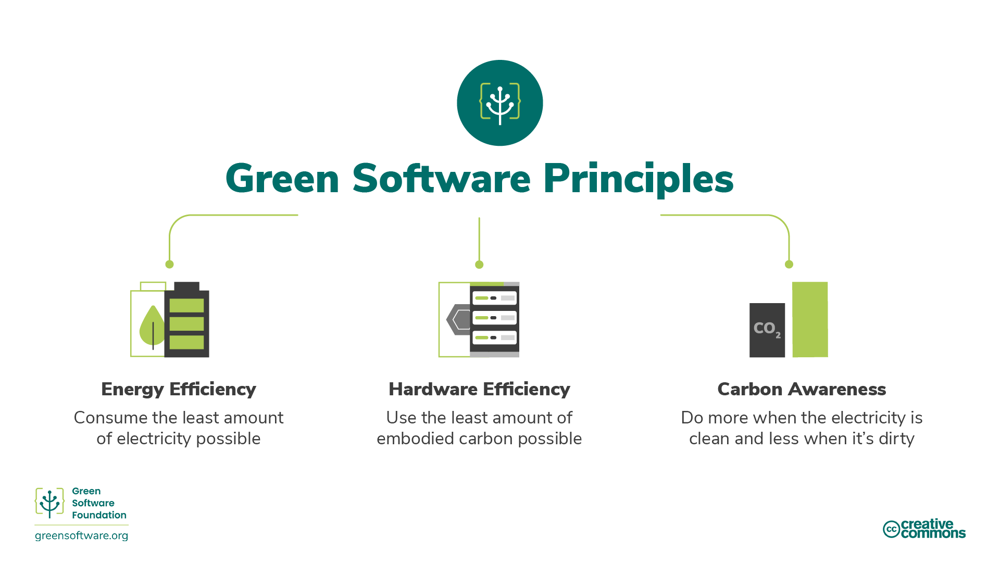

::::::::::::::::::::::::::::::::::::::: objectives

- Define green software

::::::::::::::::::::::::::::::::::::::::::::::::::

:::::::::::::::::::::::::::::::::::::::: questions

- What is green software and what does it mean for me as a user of HPC

::::::::::::::::::::::::::::::::::::::::::::::::::

## What is green software?

Green software is an emerging discipline at the intersection of climate science, software design, electricity markets, hardware, and data center design.

Green software is carbon-efficient software, meaning it emits the least carbon possible. Only three activities reduce the carbon emissions of software; energy efficiency, carbon awareness, and hardware efficiency. This training will explain all of these concepts, how to apply them to your processes and how to measure them, as well as some of the international guidelines and organizations that guide and monitor this space.

## Who should read this?

Anyone involved in the process of building, deploying, or managing software. By studying these principles, a green software practitioner can make decisions that have a meaningful impact on the carbon pollution of their applications.

## History

In 2019 the original eight principles of green software engineering were released. This 2022 update of the principles took on feedback received over the years, merging some principles and adding a new one regarding understanding climate commitments.

## How to be a green software practitioner

The following training covers 6 key areas that a green software practitioner should know:

1. **Carbon Efficiency**: Emit the least amount of carbon possible.
2. **Energy Efficiency**: Use the least amount of energy possible.
3. **Carbon Awareness**: Do more when the electricity is cleaner and do less when the electricity is dirtier.
4. **Hardware Efficiency**: Use the least amount of embodied carbon possible.
5. **Measurement**: What you can't measure, you can't improve.
6. **Climate Commitments**: Understand the exact mechanism of carbon reduction.

Each of these chapters will introduce some new concepts and explain in detail why they are important in terms of the climate, and how you can apply them to your green software practices.

## Principles, Patterns, and Practices.

This course's key areas and content describe the **principles** of green software, a core set of competencies needed to define, build and run green software.

A green software [**pattern**](https://patterns.greensoftware.foundation/) is a specific example of how to apply one or more principles in a real-world example. Whereas principles describe the theory that underpins green software, patterns are the practical advice software practitioners can use in their software applications today. Patterns are vendor-neutral.

A green software **practice** is a pattern applied to a specific vendor's product and informs practitioners about how to use that product in a more sustainable way. 

Practices should refer to patterns that should refer to principles.

The green software foundation also publishes a [catalog of vendor-neutral green software patterns](https://patterns.greensoftware.foundation/) across various categories.
 

<!--  LocalWords:  keypoints links.md endcomment
 -->

:::::::::::::::::::::::::::::::::::::::: keypoints

- Green software adheres to...

::::::::::::::::::::::::::::::::::::::::::::::::::
